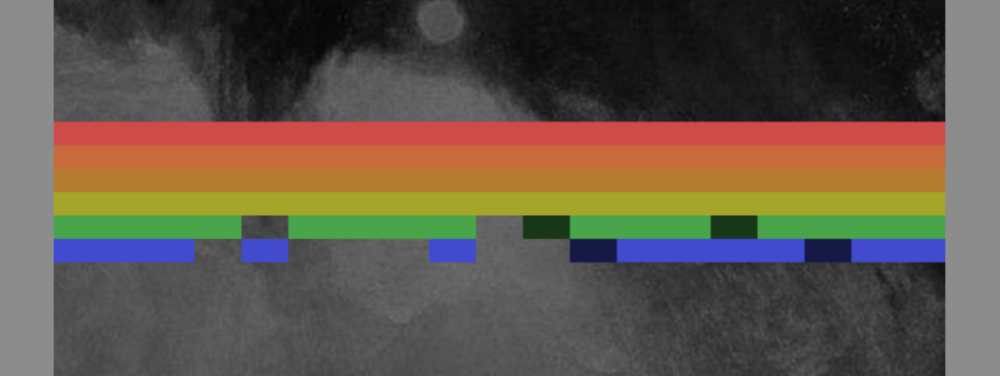

# *Sound System II*

# [Play Online](https://www.pippinbarr.com/sound-system-ii/) (desktop and mobile)

## Description
*You want to break free! You want to! Break free! If a ball hits a brick in a game, does it make a noise?! Sure sounds like it!*

Sound System II was written in Javascript/HTML5 using the [Phaser](http://phaser.io/) game framework. It is touch-based phone and tablet-friendly (but may be a little small on your phone). The sounds used are all from this [great sample bank of Roland drum machines and ARP synths](http://www.musicradar.com/news/tech/free-music-samples-download-loops-hits-and-multis-217833/70/). The painting in the background is _Snow Storm &#8211; Steam-Boat off a Harbour&#8217;s Mouth_ by [William Turner](http://en.wikipedia.org/wiki/William_Turner_%28artist%29). The gameplay and colours in the foreground are from Atari&#8217;s [Breakout](http://en.wikipedia.org/wiki/Breakout_%28video_game%29).

## Press
* [Kill Screen](http://killscreendaily.com/articles/sound-system-ii/)
* [Superlevel](http://superlevel.de/spiele/wie-ein-bumm-bumm-bumm-bumm-bumerang-sound-system-ii/)
* [Kill Screen&#8217;s Playlist award](http://killscreendaily.com/playlist/#366)

Read the [Press Kit](../press) for press information

## Documentation
* Read the [Process Documentation](../process) for todos and design explorations
* Look at the [Code Repository](https://github.com/pippinbarr/sound-system-ii) for source code etc.

## License
*Sound System II* is licensed under a [Creative Commons Attribution-NonCommercial 3.0 Unported License](http://creativecommons.org/licenses/by-nc/3.0/).
