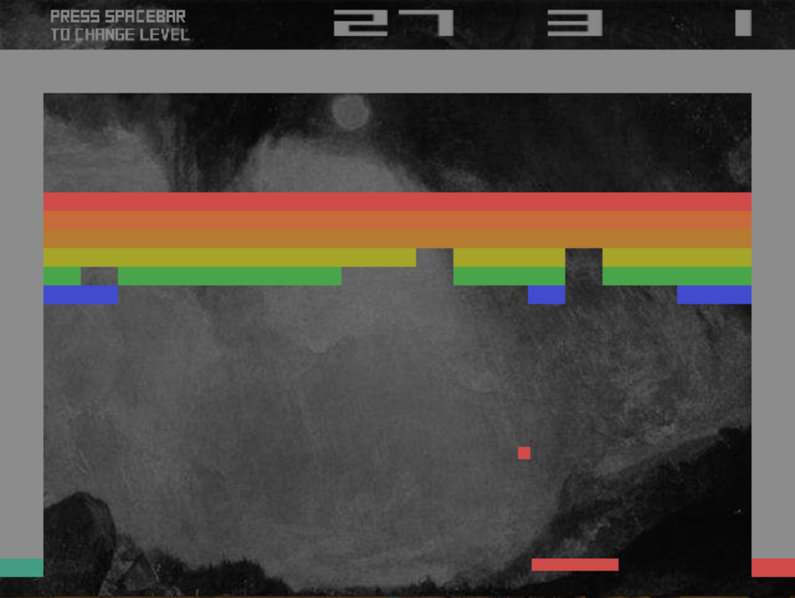
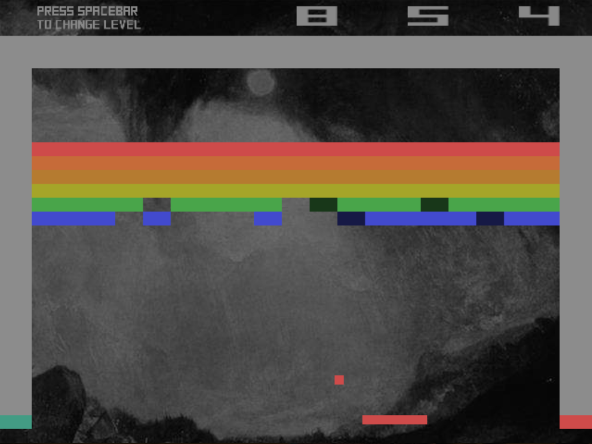

# *Sound System II*

## Information
* Released: 9 March 2015
* Website: http://www.pippinbarr.com/
* Platforms: Browser, mobile-friendly
* Link: https://www.pippinbarr.com/sound-system-ii/info
* Price: Free.

## Description
*You want to break free! You want to! Break free! If a ball hits a brick in a game, does it make a sound?! Sure sounds like it!*

## History
Sound System II exists primarily as a follow-up to Sound System I - that is, I wanted to keep exploring the idea of making games focused on sound/music because it's something I know very little about personally. I've been interested in the question of what a game "sounds like" for quite a while - not in the sense of diegetic sounds that make up a convincing world, but how the game itself sounds as a game. (See also: David Kanaga's excellent work on scoring games like Assassin's Creed, for example.) Atari's Breakout feels like a good basis for this because it's minimalist in terms of its "events" and thus allows for a kind of minimalist music. Also pleasing is the parallel between Atari's classic idea of having multiple "modes" and presenting this breakout as being multiple "instruments" for the player to play. Finally, a big point of interest that I should write something about is the idea of player skill corresponding to the skillful play of an instrument and the idea that the amount of time one can "survive" in a game might correspond to the length of a piece of music - that they are one and the same thing. The aesthetic is fairly obviously entirely taken from Atari Breakout with the exception of a William Turner painting as the background to maintain a visual connection to Sound System I.

## Features
* Arcade Physics.
* Musics.
* A painting by Edward Turner.
* Atari.
* Player-as-Musician

## Images

## Trailer
[View the Trailer on YouTube](https://www.youtube.com/watch?v=NPi1brg67DA)

## Credits
* Pippin Barr: Everything
